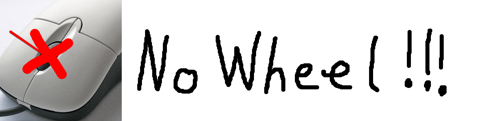

## NoWheel

NoWheel is a very simple Minecraft mod that disables the scroll wheel to switch slots in the hotbar.

It can be toggled with a keybind or in the config, 
that you can access with [Cloth Config](https://www.curseforge.com/minecraft/mc-mods/cloth-config) or [ModMenu](https://modrinth.com/mod/modmenu)

## Dependencies

- [Fabric API](https://modrinth.com/mod/fabric-api)
- [Cloth Config](https://www.curseforge.com/minecraft/mc-mods/cloth-config)
- [ModMenu](https://modrinth.com/mod/modmenu) (optional)